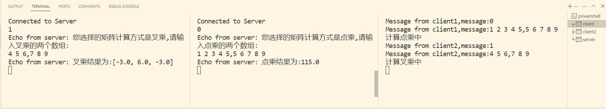

向量计算服务器设计文档

## 设计思路

采用客户端服务器架构，客户端向服务器提交向量计算任务，服务器运算后将结果返回给客户端。

## 设计过程

### 客户端

客户端程序通过基础的socket与服务器进行通信。

```java
BufferedReader stdIn = new BufferedReader(new InputStreamReader(System.in));

		Socket socket = new Socket("127.0.0.1", 8189);
		System.out.println("Connected to Server");

		InputStream inStream = socket.getInputStream();
		OutputStream outStream = socket.getOutputStream();
		BufferedReader in = new BufferedReader(new InputStreamReader(inStream));
		PrintWriter out = new PrintWriter(outStream);


		while((userInput=stdIn.readLine())!=null)
        {
            out.println(userInput);
			out.flush();
			echoMessage = in.readLine();
			System.out.println("Echo from server: " + echoMessage);
		}

		socket.close()
```

### 服务器端

采用线程池技术改进并发，避免频繁创建和销毁线程的开销。

```java
public class ThreadPool {
    public static void main(String[] args) throws Exception {
        ServerSocket listenSocket = new ServerSocket(8189);
        Socket socket = null;
        ExecutorService executorService = Executors.newFixedThreadPool(5);
        int count = 0;// 线程号
        System.out.println("Server listening at 8189");

        while (true) {
            socket = listenSocket.accept();
            count++;
            System.out.println("The total number of clients is " + count + ".");
            executorService.submit(new ServerThread(socket, count));// 提交任务
        }
    }
}
```

### 具体服务程序

```java
    public  double dotProduct(double[][] vector) {
        // 实现向量点乘
        double result = 0;
        for (int i = 0; i < vector[0].length; i++) {
            result += vector[0][i] * vector[1][i];
        }
        return result;
    }
    public  double[] crossProduct(double[][] vector) {
        // 实现向量叉乘
        double[] result = {0,0,0};
        result[0] = vector[0][1] * vector[1][2] - vector[0][2] * vector[1][1];
        result[1] = vector[0][2] * vector[1][0] - vector[0][0] * vector[1][2];
        result[2] = vector[0][0] * vector[1][1] - vector[0][1] * vector[1][0];
        return result;
    }
```

## 技术栈

* Java
* Maven

## 设计结果



## 过程中的问题

### **Maven项目中如何对代码进行部分测试**

问题描述：当在Maven项目中执行测试命令，

```bash
mvn test
```

该命令会对测试类中所有的含有Test修饰的方法进行测试。当测试数量过多时，这种方法会增加测试时间和成本。且没有必要。

解决方案有如下：

**使用@Tag标识指定的类或者方法**

```bash
mvn test -Dgroups="TagName"
mvn test -Dtest="TestClassName"# 直接制定类名
```

**使用test suit对测试类或方法进行选择**

```java
@Suite
@SuiteDisplayName("Junit Suite")
@SelectClasses({HelloWorldTest.class})
public class SuiteDemo {

}
```
