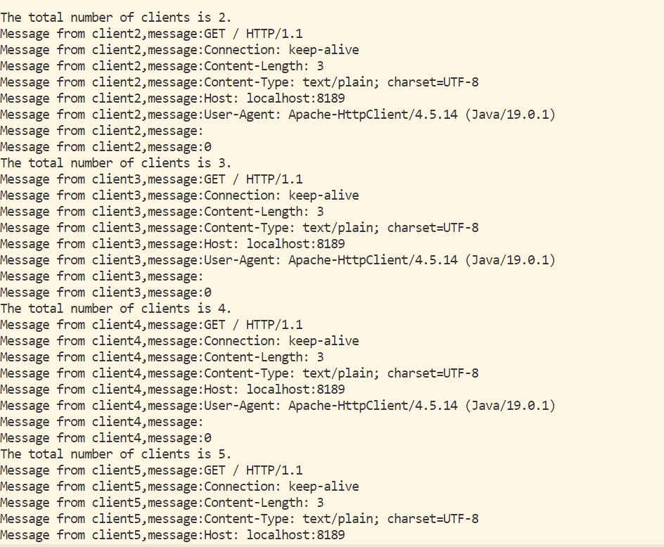
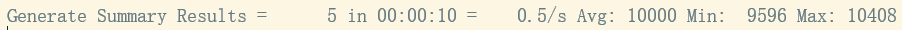
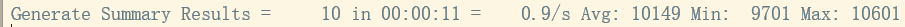
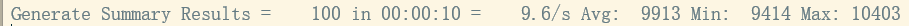
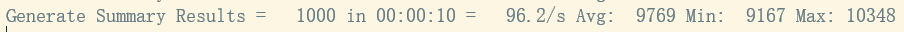
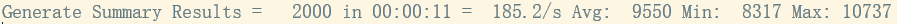

# 服务器性能测试

## 测试过程

使用**JMeter**测试服务器程序的并发性能

测试当线程池为5时，模拟不同并发量时的服务器性能指标

## 测试结果

数字解释

    线程数                     	平均每秒执行请求数    平均/最小/最大响应时间

**并发数为5**

**并发数为10**

**并发数为100**

**并发数为1000**

**并发数为2000**

当并发数大于2000时，电脑已出现明显卡顿。
